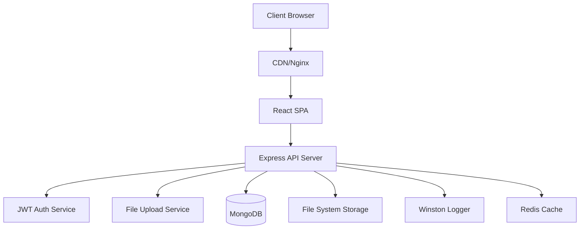

# Техническое проектирование системы "Сайт школы вождения"

## 1. Обзор архитектуры

### 1.1 Общая архитектура системы



### 1.2 Принципы проектирования

- **Separation of Concerns** - четкое разделение ответственности между слоями
- **Single Responsibility Principle** - каждый компонент отвечает за одну функцию
- **DRY (Don't Repeat Yourself)** - переиспользование кода через компоненты и хуки
- **SOLID принципы** - для серверной части
- **Component-driven Development** - разработка через компоненты
- **API-first Design** - проектирование API перед реализацией UI

## 2. Frontend архитектура

### 2.1 Структура проекта

```
src/
├── app/                          # Конфигурация приложения
│   ├── App.tsx                   # Корневой компонент
│   ├── store.ts                  # Redux store
│   └── router.tsx                # Конфигурация маршрутизации
├── pages/                        # Страницы приложения
│   ├── Home/
│   │   ├── index.tsx
│   │   ├── components/
│   │   └── hooks/
│   ├── Education/
│   │   ├── BasicInfo/
│   │   ├── Structure/
│   │   ├── Documents/
│   │   └── ...
│   └── Admin/
│       ├── Dashboard/
│       ├── ContentEditor/
│       └── FileManager/
├── shared/                       # Переиспользуемые компоненты
│   ├── ui/                       # UI компоненты
│   │   ├── Button/
│   │   ├── Modal/
│   │   ├── Form/
│   │   └── Layout/
│   ├── hooks/                    # Кастомные хуки
│   ├── utils/                    # Утилиты
│   ├── constants/                # Константы
│   └── types/                    # TypeScript типы
├── entities/                     # Бизнес-сущности
│   ├── education/
│   ├── documents/
│   ├── news/
│   └── user/
├── features/                     # Фичи приложения
│   ├── auth/
│   ├── content-management/
│   ├── file-upload/
│   └── navigation/
└── widgets/                      # Виджеты (композитные компоненты)
    ├── Header/
    ├── Footer/
    ├── Sidebar/
    └── ContentSection/
```

### 2.2 Архитектурные слои

#### 2.2.1 Presentation Layer (UI)
```typescript
// Компоненты представления
interface PageComponent {
  // Только UI логика
  // Получение данных через пропсы
  // Обработка пользовательских событий
}

// Пример структуры компонента
const BasicInfoPage: React.FC = () => {
  const { data, loading, error } = useBasicInfo();
  const { updateBasicInfo } = useContentManagement();
  
  return (
    <PageLayout>
      <ContentSection data={data} loading={loading} />
      <EditForm onSubmit={updateBasicInfo} />
    </PageLayout>
  );
};
```

#### 2.2.2 Business Logic Layer
```typescript
// Кастомные хуки для бизнес-логики
export const useBasicInfo = () => {
  const { data, isLoading, error } = useQuery({
    queryKey: ['basicInfo'],
    queryFn: () => educationAPI.getBasicInfo(),
    staleTime: 5 * 60 * 1000, // 5 минут
  });

  return {
    data,
    loading: isLoading,
    error,
  };
};

export const useContentManagement = () => {
  const queryClient = useQueryClient();
  
  const updateMutation = useMutation({
    mutationFn: educationAPI.updateBasicInfo,
    onSuccess: () => {
      queryClient.invalidateQueries({ queryKey: ['basicInfo'] });
      toast.success('Информация обновлена');
    },
  });

  return {
    updateBasicInfo: updateMutation.mutate,
    isUpdating: updateMutation.isPending,
  };
};
```

#### 2.2.3 Data Access Layer
```typescript
// API сервисы
class EducationAPI {
  private client: AxiosInstance;

  constructor() {
    this.client = axios.create({
      baseURL: '/api',
      headers: { 'Content-Type': 'application/json' },
    });
  }

  async getBasicInfo(): Promise<BasicInfo> {
    const response = await this.client.get('/info/basic');
    return response.data;
  }

  async updateBasicInfo(data: BasicInfoUpdate): Promise<BasicInfo> {
    const response = await this.client.put('/admin/info/basic', data);
    return response.data;
  }
}

export const educationAPI = new EducationAPI();
```

### 2.3 Управление состоянием

#### 2.3.1 React Query для серверного состояния
```typescript
// Конфигурация React Query
const queryClient = new QueryClient({
  defaultOptions: {
    queries: {
      staleTime: 5 * 60 * 1000, // 5 минут
      refetchOnWindowFocus: false,
      retry: (failureCount, error) => {
        if (error.status === 404) return false;
        return failureCount < 3;
      },
    },
  },
});

// Ключи запросов
export const queryKeys = {
  education: {
    all: ['education'] as const,
    basic: () => [...queryKeys.education.all, 'basic'] as const,
    structure: () => [...queryKeys.education.all, 'structure'] as const,
    documents: () => [...queryKeys.education.all, 'documents'] as const,
  },
  news: {
    all: ['news'] as const,
    list: (params: NewsParams) => 
      [...queryKeys.news.all, 'list', params] as const,
    detail: (id: string) => 
      [...queryKeys.news.all, 'detail', id] as const,
  },
} as const;
```

#### 2.3.2 Zustand для клиентского состояния
```typescript
interface AppState {
  // UI состояние
  sidebarOpen: boolean;
  theme: 'light' | 'dark';
  
  // Пользователь
  user: User | null;
  isAuthenticated: boolean;
  
  // Действия
  toggleSidebar: () => void;
  setTheme: (theme: 'light' | 'dark') => void;
  setUser: (user: User | null) => void;
}

export const useAppStore = create<AppState>((set) => ({
  sidebarOpen: false,
  theme: 'light',
  user: null,
  isAuthenticated: false,
  
  toggleSidebar: () => set((state) => ({ 
    sidebarOpen: !state.sidebarOpen 
  })),
  
  setTheme: (theme) => set({ theme }),
  
  setUser: (user) => set({ 
    user, 
    isAuthenticated: !!user 
  }),
}));
```

### 2.4 Компонентная архитектура

#### 2.4.1 Atomic Design принципы
```
Atoms (Атомы)
├── Button
├── Input
├── Typography
└── Icon

Molecules (Молекулы)
├── FormField (Input + Label + Error)
├── SearchBox (Input + Button)
└── Card (Typography + Button)

Organisms (Организмы)
├── Header (Logo + Navigation + SearchBox)
├── ContentForm (Multiple FormFields)
└── DocumentList (Multiple Cards)

Templates (Шаблоны)
├── PageLayout
├── AdminLayout
└── ContentLayout

Pages (Страницы)
├── HomePage
├── BasicInfoPage
└── AdminDashboard
```

#### 2.4.2 Примеры компонентов

**Атом - Button**
```typescript
interface ButtonProps {
  variant: 'primary' | 'secondary' | 'danger';
  size: 'small' | 'medium' | 'large';
  disabled?: boolean;
  loading?: boolean;
  onClick?: () => void;
  children: React.ReactNode;
}

export const Button: React.FC<ButtonProps> = ({
  variant,
  size,
  disabled,
  loading,
  onClick,
  children,
}) => {
  const classes = cn(
    'button',
    `button--${variant}`,
    `button--${size}`,
    {
      'button--disabled': disabled,
      'button--loading': loading,
    }
  );

  return (
    <button
      className={classes}
      disabled={disabled || loading}
      onClick={onClick}
    >
      {loading && <Spinner size="small" />}
      {children}
    </button>
  );
};
```

**Молекула - FormField**
```typescript
interface FormFieldProps {
  label: string;
  error?: string;
  required?: boolean;
  children: React.ReactElement;
}

export const FormField: React.FC<FormFieldProps> = ({
  label,
  error,
  required,
  children,
}) => {
  const id = useId();
  
  return (
    <div className="form-field">
      <label htmlFor={id} className="form-field__label">
        {label}
        {required && <span className="form-field__required">*</span>}
      </label>
      
      {React.cloneElement(children, { id, 'aria-invalid': !!error })}
      
      {error && (
        <span className="form-field__error" role="alert">
          {error}
        </span>
      )}
    </div>
  );
};
```

### 2.5 Маршрутизация

```typescript
// Конфигурация роутов
export const router = createBrowserRouter([
  {
    path: '/',
    element: <PublicLayout />,
    children: [
      { index: true, element: <HomePage /> },
      {
        path: 'education',
        children: [
          { path: 'basic', element: <BasicInfoPage /> },
          { path: 'structure', element: <StructurePage /> },
          { path: 'documents', element: <DocumentsPage /> },
          { path: 'programs', element: <ProgramsPage /> },
          { path: 'staff', element: <StaffPage /> },
          { path: 'materials', element: <MaterialsPage /> },
          { path: 'services', element: <ServicesPage /> },
          { path: 'vacancies', element: <VacanciesPage /> },
        ],
      },
      { path: 'news', element: <NewsPage /> },
      { path: 'news/:id', element: <NewsDetailPage /> },
      { path: 'contacts', element: <ContactsPage /> },
    ],
  },
  {
    path: '/admin',
    element: <AdminLayout />,
    loader: adminAuthLoader,
    children: [
      { index: true, element: <AdminDashboard /> },
      { path: 'content/:section', element: <ContentEditor /> },
      { path: 'files', element: <FileManager /> },
      { path: 'news', element: <NewsManager /> },
      { path: 'logs', element: <AuditLogs /> },
    ],
  },
  {
    path: '/auth',
    element: <AuthLayout />,
    children: [
      { path: 'login', element: <LoginPage /> },
      { path: 'forgot-password', element: <ForgotPasswordPage /> },
    ],
  },
]);

// Защищенный лоадер для админки
async function adminAuthLoader() {
  const token = localStorage.getItem('authToken');
  
  if (!token) {
    throw redirect('/auth/login');
  }
  
  try {
    const user = await authAPI.verifyToken(token);
    return { user };
  } catch {
    localStorage.removeItem('authToken');
    throw redirect('/auth/login');
  }
}
```

## 3. Backend архитектура

### 3.1 Структура серверного проекта

```
server/
├── src/
│   ├── app.ts                    # Express приложение
│   ├── server.ts                 # HTTP сервер
│   ├── config/                   # Конфигурация
│   │   ├── database.ts
│   │   ├── auth.ts
│   │   └── upload.ts
│   ├── controllers/              # Контроллеры
│   │   ├── auth.controller.ts
│   │   ├── education.controller.ts
│   │   ├── news.controller.ts
│   │   └── files.controller.ts
│   ├── models/                   # Модели данных
│   │   ├── User.ts
│   │   ├── SiteInfo.ts
│   │   ├── Document.ts
│   │   └── News.ts
│   ├── routes/                   # Маршруты
│   │   ├── index.ts
│   │   ├── auth.routes.ts
│   │   ├── education.routes.ts
│   │   └── files.routes.ts
│   ├── middleware/               # Промежуточное ПО
│   │   ├── auth.middleware.ts
│   │   ├── validation.middleware.ts
│   │   ├── upload.middleware.ts
│   │   └── error.middleware.ts
│   ├── services/                 # Бизнес-логика
│   │   ├── auth.service.ts
│   │   ├── education.service.ts
│   │   ├── file.service.ts
│   │   └── audit.service.ts
│   ├── utils/                    # Утилиты
│   │   ├── logger.ts
│   │   ├── validation.ts
│   │   └── errors.ts
│   └── types/                    # TypeScript типы
│       ├── express.d.ts
│       └── models.ts
├── uploads/                      # Загруженные файлы
├── logs/                         # Логи
└── tests/                        # Тесты
```

### 3.2 Архитектурные слои backend

#### 3.2.1 Controller Layer
```typescript
// Контроллеры обрабатывают HTTP запросы
export class EducationController {
  private educationService: EducationService;
  private auditService: AuditService;

  constructor() {
    this.educationService = new EducationService();
    this.auditService = new AuditService();
  }

  getBasicInfo = async (req: Request, res: Response, next: NextFunction) => {
    try {
      const basicInfo = await this.educationService.getBasicInfo();
      res.json(basicInfo);
    } catch (error) {
      next(error);
    }
  };

  updateBasicInfo = async (req: Request, res: Response, next: NextFunction) => {
    try {
      const { body } = req;
      const user = req.user!;
      
      const updatedInfo = await this.educationService.updateBasicInfo(body);
      
      // Аудит лог
      await this.auditService.log({
        userId: user.id,
        action: 'UPDATE_BASIC_INFO',
        resource: 'education',
        changes: body,
        timestamp: new Date(),
      });
      
      res.json(updatedInfo);
    } catch (error) {
      next(error);
    }
  };
}
```

#### 3.2.2 Service Layer
```typescript
// Сервисы содержат бизнес-логику
export class EducationService {
  async getBasicInfo(): Promise<BasicInfo> {
    const siteInfo = await SiteInfo.findOne({ type: 'basic' });
    
    if (!siteInfo) {
      throw new NotFoundError('Основные сведения не найдены');
    }
    
    return siteInfo.data;
  }

  async updateBasicInfo(data: BasicInfoUpdate): Promise<BasicInfo> {
    // Валидация
    const validatedData = await this.validateBasicInfo(data);
    
    // Обновление
    const siteInfo = await SiteInfo.findOneAndUpdate(
      { type: 'basic' },
      { 
        data: validatedData,
        updatedAt: new Date(),
      },
      { new: true, upsert: true }
    );
    
    // Очистка кеша
    await this.clearCache('basic');
    
    return siteInfo.data;
  }

  private async validateBasicInfo(data: BasicInfoUpdate): Promise<BasicInfo> {
    const schema = basicInfoSchema;
    return await schema.validateAsync(data);
  }

  private async clearCache(key: string): Promise<void> {
    // Очистка Redis кеша
    await redis.del(`education:${key}`);
  }
}
```

#### 3.2.3 Model Layer
```typescript
// Модели данных (Mongoose)
interface ISiteInfo extends Document {
  type: 'basic' | 'structure' | 'documents' | 'education' | 'staff' | 'materials' | 'services' | 'vacancies';
  data: any;
  createdAt: Date;
  updatedAt: Date;
}

const siteInfoSchema = new Schema<ISiteInfo>({
  type: {
    type: String,
    required: true,
    enum: ['basic', 'structure', 'documents', 'education', 'staff', 'materials', 'services', 'vacancies'],
    unique: true,
  },
  data: {
    type: Schema.Types.Mixed,
    required: true,
  },
}, {
  timestamps: true,
});

siteInfoSchema.index({ type: 1 });

export const SiteInfo = model<ISiteInfo>('SiteInfo', siteInfoSchema);

// Типизированные интерфейсы
export interface BasicInfo {
  fullName: string;
  shortName: string;
  foundedDate: Date;
  legalAddress: string;
  actualAddress: string;
  phone: string;
  email: string;
  founder: {
    name: string;
    address: string;
    phone: string;
    email: string;
  };
  workSchedule: {
    weekdays: string;
    weekend: string;
    holidays: string;
  };
  branches?: Array<{
    name: string;
    address: string;
    phone: string;
  }>;
}
```

### 3.3 API Design

#### 3.3.1 RESTful API структура
```typescript
// Публичные API
GET    /api/info/basic           # Основные сведения
GET    /api/info/structure       # Структура организации
GET    /api/info/documents       # Документы
GET    /api/info/education       # Образование
GET    /api/info/staff           # Педагогический состав
GET    /api/info/materials       # Материально-техническое обеспечение
GET    /api/info/services        # Платные услуги
GET    /api/info/vacancies       # Вакантные места

GET    /api/news                 # Список новостей
GET    /api/news/:id             # Конкретная новость

GET    /api/files/:id            # Скачивание файла

// Административные API
POST   /api/auth/login           # Вход
POST   /api/auth/logout          # Выход
POST   /api/auth/refresh         # Обновление токена

PUT    /api/admin/info/basic     # Обновление основных сведений
PUT    /api/admin/info/structure # Обновление структуры
PUT    /api/admin/info/documents # Обновление документов
PUT    /api/admin/info/education # Обновление образования
PUT    /api/admin/info/staff     # Обновление педагогического состава
PUT    /api/admin/info/materials # Обновление материально-технического обеспечения
PUT    /api/admin/info/services  # Обновление платных услуг
PUT    /api/admin/info/vacancies # Обновление вакантных мест

POST   /api/admin/files          # Загрузка файла
DELETE /api/admin/files/:id      # Удаление файла

GET    /api/admin/news           # Управление новостями
POST   /api/admin/news           # Создание новости
PUT    /api/admin/news/:id       # Обновление новости
DELETE /api/admin/news/:id       # Удаление новости

GET    /api/admin/logs           # Журнал изменений
```

#### 3.3.2 Middleware pipeline
```typescript
// Конфигурация middleware
app.use(helmet());                    // Безопасность заголовков
app.use(cors(corsOptions));           // CORS
app.use(compression());               // Сжатие ответов
app.use(express.json({ limit: '10mb' })); // Парсинг JSON
app.use(express.urlencoded({ extended: true }));
app.use(morgan('combined', { stream: logger.stream })); // Логирование
app.use('/uploads', express.static('uploads')); // Статические файлы

// Маршруты
app.use('/api/auth', authRoutes);
app.use('/api/info', publicRoutes);
app.use('/api/news', newsRoutes);
app.use('/api/files', fileRoutes);
app.use('/api/admin', authMiddleware, adminRoutes);

// Обработка ошибок
app.use(notFoundMiddleware);
app.use(errorMiddleware);

// Middleware для аутентификации
export const authMiddleware = async (req: Request, res: Response, next: NextFunction) => {
  try {
    const token = req.headers.authorization?.replace('Bearer ', '');
    
    if (!token) {
      throw new UnauthorizedError('Токен не предоставлен');
    }
    
    const decoded = jwt.verify(token, JWT_SECRET) as JWTPayload;
    const user = await User.findById(decoded.userId);
    
    if (!user) {
      throw new UnauthorizedError('Пользователь не найден');
    }
    
    req.user = user;
    next();
  } catch (error) {
    next(new UnauthorizedError('Недействительный токен'));
  }
};
```

## 4. База данных

### 4.1 Схема данных MongoDB

```typescript
// Коллекция: siteinfo
{
  _id: ObjectId,
  type: 'basic' | 'structure' | 'documents' | 'education' | 'staff' | 'materials' | 'services' | 'vacancies',
  data: {
    // Динамические данные в зависимости от типа
  },
  createdAt: Date,
  updatedAt: Date
}

// Коллекция: documents
{
  _id: ObjectId,
  title: String,
  description: String,
  fileName: String,
  originalName: String,
  mimeType: String,
  size: Number,
  category: 'charter' | 'license' | 'accreditation' | 'reports' | 'regulations' | 'other',
  uploadedBy: ObjectId, // ссылка на пользователя
  createdAt: Date,
  updatedAt: Date
}

// Коллекция: news
{
  _id: ObjectId,
  title: String,
  slug: String,
  content: String,
  excerpt: String,
  featuredImage?: String,
  images: [String],
  status: 'draft' | 'published' | 'archived',
  publishedAt?: Date,
  author: ObjectId, // ссылка на пользователя
  views: Number,
  createdAt: Date,
  updatedAt: Date
}

// Коллекция: users
{
  _id: ObjectId,
  email: String,
  password: String, // хешированный
  name: String,
  role: 'admin' | 'editor',
  isActive: Boolean,
  lastLogin?: Date,
  createdAt: Date,
  updatedAt: Date
}

// Коллекция: auditlogs
{
  _id: ObjectId,
  userId: ObjectId,
  action: String,
  resource: String,
  resourceId?: String,
  changes?: Object,
  ip: String,
  userAgent: String,
  timestamp: Date
}

// Коллекция: settings
{
  _id: ObjectId,
  key: String,
  value: Schema.Types.Mixed,
  description?: String,
  updatedBy: ObjectId,
  updatedAt: Date
}
```

### 4.2 Индексы

```typescript
// Индексы для оптимизации запросов
await db.collection('siteinfo').createIndex({ type: 1 }, { unique: true });
await db.collection('documents').createIndex({ category: 1, createdAt: -1 });
await db.collection('news').createIndex({ status: 1, publishedAt: -1 });
await db.collection('news').createIndex({ slug: 1 }, { unique: true });
await db.collection('users').createIndex({ email: 1 }, { unique: true });
await db.collection('auditlogs').createIndex({ userId: 1, timestamp: -1 });
await db.collection('auditlogs').createIndex({ timestamp: -1 }); // TTL индекс
await db.collection('settings').createIndex({ key: 1 }, { unique: true });
```

## 5. Безопасность

### 5.1 Аутентификация и авторизация

```typescript
// JWT конфигурация
const JWT_CONFIG = {
  secret: process.env.JWT_SECRET!,
  expiresIn: '15m',
  refreshExpiresIn: '7d',
  issuer: 'driving-school-site',
  audience: 'driving-school-users',
};

// Генерация токенов
export const generateTokens = (user: IUser) => {
  const payload = {
    userId: user._id,
    email: user.email,
    role: user.role,
  };

  const accessToken = jwt.sign(payload, JWT_CONFIG.secret, {
    expiresIn: JWT_CONFIG.expiresIn,
    issuer: JWT_CONFIG.issuer,
    audience: JWT_CONFIG.audience,
  });

  const refreshToken = jwt.sign(payload, JWT_CONFIG.secret, {
    expiresIn: JWT_CONFIG.refreshExpiresIn,
    issuer: JWT_CONFIG.issuer,
    audience: JWT_CONFIG.audience,
  });

  return { accessToken, refreshToken };
};

// Middleware авторизации по ролям
export const requireRole = (allowedRoles: string[]) => {
  return (req: Request, res: Response, next: NextFunction) => {
    const user = req.user;
    
    if (!user || !allowedRoles.includes(user.role)) {
      throw new ForbiddenError('Недостаточно прав для выполнения операции');
    }
    
    next();
  };
};
```

### 5.2 Валидация данных

```typescript
// Схемы валидации с Joi
export const basicInfoSchema = Joi.object({
  fullName: Joi.string().required().max(255),
  shortName: Joi.string().required().max(100),
  foundedDate: Joi.date().required(),
  legalAddress: Joi.string().required().max(500),
  actualAddress: Joi.string().required().max(500),
  phone: Joi.string().pattern(/^\+7\d{10}$/).required(),
  email: Joi.string().email().required(),
  founder: Joi.object({
    name: Joi.string().required().max(255),
    address: Joi.string().required().max(500),
    phone: Joi.string().pattern(/^\+7\d{10}$/).required(),
    email: Joi.string().email().required(),
  }).required(),
  workSchedule: Joi.object({
    weekdays: Joi.string().required().max(100),
    weekend: Joi.string().required().max(100),
    holidays: Joi.string().required().max(100),
  }).required(),
  branches: Joi.array().items(
    Joi.object({
      name: Joi.string().required().max(255),
      address: Joi.string().required().max(500),
      phone: Joi.string().pattern(/^\+7\d{10}$/).required(),
    })
  ).optional(),
});

// Middleware валидации
export const validate = (schema: Joi.ObjectSchema) => {
  return (req: Request, res: Response, next: NextFunction) => {
    const { error, value } = schema.validate(req.body);
    
    if (error) {
      throw new ValidationError(error.details[0].message);
    }
    
    req.body = value;
    next();
  };
};
```

### 5.3 Защита от атак

```typescript
// Rate limiting
import rateLimit from 'express-rate-limit';

const authLimiter = rateLimit({
  windowMs: 15 * 60 * 1000, // 15 минут
  max: 5, // максимум 5 попыток входа
  message: 'Слишком много попыток входа, попробуйте позже',
  standardHeaders: true,
  legacyHeaders: false,
});

const apiLimiter = rateLimit({
  windowMs: 15 * 60 * 1000,
  max: 100, // максимум 100 запросов к API
  message: 'Слишком много запросов, попробуйте позже',
});

// Применение лимитов
app.use('/api/auth', authLimiter);
app.use('/api', apiLimiter);

// Sanitization
import mongoSanitize from 'express-mongo-sanitize';
import xss from 'xss';

app.use(mongoSanitize()); // Защита от NoSQL инъекций

const sanitizeInput = (req: Request, res: Response, next: NextFunction) => {
  if (req.body) {
    req.body = sanitizeObject(req.body);
  }
  next();
};

const sanitizeObject = (obj: any): any => {
  if (typeof obj === 'string') {
    return xss(obj);
  }
  
  if (Array.isArray(obj)) {
    return obj.map(sanitizeObject);
  }
  
  if (obj && typeof obj === 'object') {
    const sanitized: any = {};
    for (const key in obj) {
      sanitized[key] = sanitizeObject(obj[key]);
    }
    return sanitized;
  }
  
  return obj;
};
```

## 6. Производительность

### 6.1 Кеширование

```typescript
// Redis конфигурация
import Redis from 'ioredis';

const redis = new Redis({
  host: process.env.REDIS_HOST || 'localhost',
  port: parseInt(process.env.REDIS_PORT || '6379'),
  retryDelayOnFailover: 100,
  maxRetriesPerRequest: 3,
});

// Middleware кеширования
export const cacheMiddleware = (duration: number = 300) => {
  return async (req: Request, res: Response, next: NextFunction) => {
    const key = `cache:${req.originalUrl}`;
    
    try {
      const cached = await redis.get(key);
      
      if (cached) {
        return res.json(JSON.parse(cached));
      }
      
      // Перехват ответа для кеширования
      const originalSend = res.json;
      res.json = function(data: any) {
        redis.setex(key, duration, JSON.stringify(data));
        return originalSend.call(this, data);
      };
      
      next();
    } catch (error) {
      logger.error('Cache error:', error);
      next();
    }
  };
};

// Инвалидация кеша
export const invalidateCache = async (pattern: string) => {
  const keys = await redis.keys(`cache:*${pattern}*`);
  if (keys.length > 0) {
    await redis.del(...keys);
  }
};
```

### 6.2 Оптимизация запросов

```typescript
// Пагинация
export interface PaginationOptions {
  page: number;
  limit: number;
  sortBy?: string;
  sortOrder?: 'asc' | 'desc';
}

export const paginate = async <T>(
  model: Model<T>,
  filter: any,
  options: PaginationOptions
) => {
  const { page, limit, sortBy = 'createdAt', sortOrder = 'desc' } = options;
  const skip = (page - 1) * limit;
  
  const [data, total] = await Promise.all([
    model
      .find(filter)
      .sort({ [sortBy]: sortOrder === 'desc' ? -1 : 1 })
      .skip(skip)
      .limit(limit)
      .lean(),
    model.countDocuments(filter),
  ]);
  
  return {
    data,
    pagination: {
      page,
      limit,
      total,
      pages: Math.ceil(total / limit),
      hasNext: page * limit < total,
      hasPrev: page > 1,
    },
  };
};

// Агрегация для сложных запросов
export const getNewsWithStats = async (filters: any) => {
  return await News.aggregate([
    { $match: filters },
    {
      $lookup: {
        from: 'users',
        localField: 'author',
        foreignField: '_id',
        as: 'authorInfo',
      },
    },
    {
      $addFields: {
        authorName: { $arrayElemAt: ['$authorInfo.name', 0] },
      },
    },
    {
      $project: {
        title: 1,
        excerpt: 1,
        publishedAt: 1,
        views: 1,
        authorName: 1,
      },
    },
    { $sort: { publishedAt: -1 } },
  ]);
};
```

### 6.3 Оптимизация файлов

```typescript
// Middleware для обработки загрузки файлов
import multer from 'multer';
import sharp from 'sharp';
import path from 'path';

const storage = multer.diskStorage({
  destination: (req, file, cb) => {
    const uploadPath = path.join(__dirname, '../uploads', file.fieldname);
    cb(null, uploadPath);
  },
  filename: (req, file, cb) => {
    const uniqueSuffix = Date.now() + '-' + Math.round(Math.random() * 1E9);
    cb(null, `${uniqueSuffix}-${file.originalname}`);
  },
});

const upload = multer({
  storage,
  limits: {
    fileSize: 10 * 1024 * 1024, // 10MB
  },
  fileFilter: (req, file, cb) => {
    const allowedMimes = [
      'image/jpeg',
      'image/png',
      'image/webp',
      'application/pdf',
      'application/msword',
      'application/vnd.openxmlformats-officedocument.wordprocessingml.document',
    ];
    
    if (allowedMimes.includes(file.mimetype)) {
      cb(null, true);
    } else {
      cb(new Error('Неподдерживаемый тип файла'));
    }
  },
});

// Оптимизация изображений
export const optimizeImage = async (inputPath: string, outputPath: string) => {
  await sharp(inputPath)
    .resize(1920, 1080, {
      fit: 'inside',
      withoutEnlargement: true,
    })
    .jpeg({ quality: 85 })
    .toFile(outputPath);
  
  // Создание thumbnail
  const thumbnailPath = outputPath.replace(/(\.[^.]+)$/, '-thumb$1');
  await sharp(inputPath)
    .resize(300, 200, {
      fit: 'cover',
    })
    .jpeg({ quality: 75 })
    .toFile(thumbnailPath);
};
```

## 7. Мониторинг и логирование

### 7.1 Логирование

```typescript
// Winston конфигурация
import winston from 'winston';
import DailyRotateFile from 'winston-daily-rotate-file';

const logFormat = winston.format.combine(
  winston.format.timestamp(),
  winston.format.errors({ stack: true }),
  winston.format.json()
);

export const logger = winston.createLogger({
  level: process.env.LOG_LEVEL || 'info',
  format: logFormat,
  defaultMeta: { service: 'driving-school-api' },
  transports: [
    // Ошибки
    new DailyRotateFile({
      filename: 'logs/error-%DATE%.log',
      datePattern: 'YYYY-MM-DD',
      level: 'error',
      maxSize: '20m',
      maxFiles: '14d',
    }),
    
    // Все логи
    new DailyRotateFile({
      filename: 'logs/combined-%DATE%.log',
      datePattern: 'YYYY-MM-DD',
      maxSize: '20m',
      maxFiles: '14d',
    }),
  ],
});

// В development добавляем консоль
if (process.env.NODE_ENV !== 'production') {
  logger.add(new winston.transports.Console({
    format: winston.format.combine(
      winston.format.colorize(),
      winston.format.simple()
    ),
  }));
}

// Логирование запросов
export const requestLogger = (req: Request, res: Response, next: NextFunction) => {
  const start = Date.now();
  
  res.on('finish', () => {
    const duration = Date.now() - start;
    
    logger.info('HTTP Request', {
      method: req.method,
      url: req.url,
      statusCode: res.statusCode,
      duration,
      userAgent: req.get('User-Agent'),
      ip: req.ip,
      userId: req.user?.id,
    });
  });
  
  next();
};
```

### 7.2 Мониторинг здоровья системы

```typescript
// Health check endpoint
export const healthCheck = async (req: Request, res: Response) => {
  const checks = await Promise.allSettled([
    checkDatabase(),
    checkRedis(),
    checkFileSystem(),
  ]);

  const health = {
    status: 'ok',
    timestamp: new Date().toISOString(),
    uptime: process.uptime(),
    memory: process.memoryUsage(),
    checks: {
      database: checks[0].status === 'fulfilled' ? 'ok' : 'error',
      redis: checks[1].status === 'fulfilled' ? 'ok' : 'error',
      fileSystem: checks[2].status === 'fulfilled' ? 'ok' : 'error',
    },
  };

  const hasErrors = Object.values(health.checks).includes('error');
  
  res.status(hasErrors ? 500 : 200).json(health);
};

const checkDatabase = async () => {
  await mongoose.connection.db.admin().ping();
};

const checkRedis = async () => {
  await redis.ping();
};

const checkFileSystem = async () => {
  const fs = require('fs').promises;
  await fs.access('./uploads');
};

// Метрики производительности
export const metricsMiddleware = (req: Request, res: Response, next: NextFunction) => {
  const start = process.hrtime.bigint();
  
  res.on('finish', () => {
    const duration = Number(process.hrtime.bigint() - start) / 1000000; // в миллисекундах
    
    // Отправка метрик (например, в Prometheus)
    httpRequestDuration.observe(
      { method: req.method, route: req.route?.path, status_code: res.statusCode },
      duration
    );
    
    httpRequestTotal.inc({
      method: req.method,
      route: req.route?.path,
      status_code: res.statusCode,
    });
  });
  
  next();
};
```

## 8. Тестирование

### 8.1 Unit тесты (Frontend)

```typescript
// Тестирование компонентов
import { render, screen, fireEvent, waitFor } from '@testing-library/react';
import { QueryClient, QueryClientProvider } from '@tanstack/react-query';
import { BasicInfoPage } from '../BasicInfoPage';

const createWrapper = () => {
  const queryClient = new QueryClient({
    defaultOptions: {
      queries: { retry: false },
      mutations: { retry: false },
    },
  });
  
  return ({ children }: { children: React.ReactNode }) => (
    <QueryClientProvider client={queryClient}>
      {children}
    </QueryClientProvider>
  );
};

describe('BasicInfoPage', () => {
  it('displays basic information correctly', async () => {
    render(<BasicInfoPage />, { wrapper: createWrapper() });
    
    await waitFor(() => {
      expect(screen.getByText('Основные сведения')).toBeInTheDocument();
    });
  });
  
  it('shows edit form when edit button is clicked', async () => {
    render(<BasicInfoPage />, { wrapper: createWrapper() });
    
    const editButton = await screen.findByText('Редактировать');
    fireEvent.click(editButton);
    
    expect(screen.getByLabelText('Полное наименование')).toBeInTheDocument();
  });
});

// Тестирование хуков
import { renderHook, waitFor } from '@testing-library/react';
import { useBasicInfo } from '../useBasicInfo';

describe('useBasicInfo', () => {
  it('fetches basic info successfully', async () => {
    const { result } = renderHook(() => useBasicInfo(), {
      wrapper: createWrapper(),
    });
    
    await waitFor(() => {
      expect(result.current.data).toBeDefined();
      expect(result.current.loading).toBe(false);
    });
  });
});
```

### 8.2 Integration тесты (Backend)

```typescript
// Тестирование API endpoints
import request from 'supertest';
import { app } from '../app';
import { connectTestDB, closeTestDB } from '../utils/testDB';

describe('Education API', () => {
  beforeAll(async () => {
    await connectTestDB();
  });
  
  afterAll(async () => {
    await closeTestDB();
  });
  
  describe('GET /api/info/basic', () => {
    it('returns basic information', async () => {
      const response = await request(app)
        .get('/api/info/basic')
        .expect(200);
      
      expect(response.body).toHaveProperty('fullName');
      expect(response.body).toHaveProperty('shortName');
    });
  });
  
  describe('PUT /api/admin/info/basic', () => {
    it('updates basic information when authenticated', async () => {
      const token = await getAuthToken();
      const updateData = {
        fullName: 'Updated School Name',
        shortName: 'USN',
      };
      
      const response = await request(app)
        .put('/api/admin/info/basic')
        .set('Authorization', `Bearer ${token}`)
        .send(updateData)
        .expect(200);
      
      expect(response.body.fullName).toBe(updateData.fullName);
    });
    
    it('returns 401 when not authenticated', async () => {
      await request(app)
        .put('/api/admin/info/basic')
        .send({})
        .expect(401);
    });
  });
});
```

### 8.3 E2E тесты

```typescript
// Playwright тесты
import { test, expect } from '@playwright/test';

test.describe('Admin Panel', () => {
  test.beforeEach(async ({ page }) => {
    await page.goto('/auth/login');
    await page.fill('[name="email"]', 'admin@example.com');
    await page.fill('[name="password"]', 'password');
    await page.click('button[type="submit"]');
    await page.waitForURL('/admin');
  });
  
  test('can edit basic information', async ({ page }) => {
    await page.click('text=Основные сведения');
    await page.click('text=Редактировать');
    
    await page.fill('[name="fullName"]', 'New School Name');
    await page.click('text=Сохранить');
    
    await expect(page.locator('text=Изменения сохранены')).toBeVisible();
  });
  
  test('can upload document', async ({ page }) => {
    await page.click('text=Документы');
    await page.click('text=Загрузить документ');
    
    await page.setInputFiles('[type="file"]', 'tests/fixtures/document.pdf');
    await page.fill('[name="title"]', 'Test Document');
    await page.selectOption('[name="category"]', 'charter');
    await page.click('text=Загрузить');
    
    await expect(page.locator('text=Документ загружен')).toBeVisible();
  });
});
```

## 9. Развертывание

### 9.1 Docker конфигурация

```dockerfile
# Dockerfile для frontend
FROM node:18-alpine AS builder

WORKDIR /app
COPY package*.json ./
RUN npm ci --only=production

COPY . .
RUN npm run build

FROM nginx:alpine
COPY --from=builder /app/dist /usr/share/nginx/html
COPY nginx.conf /etc/nginx/nginx.conf

EXPOSE 80
CMD ["nginx", "-g", "daemon off;"]
```

```dockerfile
# Dockerfile для backend
FROM node:18-alpine

WORKDIR /app
COPY package*.json ./
RUN npm ci --only=production

COPY . .
RUN npm run build

USER node
EXPOSE 3000

CMD ["node", "dist/server.js"]
```

### 9.2 Docker Compose

```yaml
version: '3.8'

services:
  frontend:
    build:
      context: ./client
      dockerfile: Dockerfile
    ports:
      - "80:80"
      - "443:443"
    volumes:
      - ./ssl:/etc/nginx/ssl
    depends_on:
      - backend

  backend:
    build:
      context: ./server
      dockerfile: Dockerfile
    ports:
      - "3000:3000"
    environment:
      - NODE_ENV=production
      - DATABASE_URL=mongodb://mongo:27017/driving_school
      - REDIS_URL=redis://redis:6379
      - JWT_SECRET=${JWT_SECRET}
    volumes:
      - ./uploads:/app/uploads
      - ./logs:/app/logs
    depends_on:
      - mongo
      - redis

  mongo:
    image: mongo:6
    volumes:
      - mongo_data:/data/db
    environment:
      - MONGO_INITDB_ROOT_USERNAME=${MONGO_ROOT_USERNAME}
      - MONGO_INITDB_ROOT_PASSWORD=${MONGO_ROOT_PASSWORD}

  redis:
    image: redis:7-alpine
    volumes:
      - redis_data:/data

volumes:
  mongo_data:
  redis_data:
```

### 9.3 CI/CD Pipeline

```yaml
# .github/workflows/deploy.yml
name: Deploy

on:
  push:
    branches: [main]

jobs:
  test:
    runs-on: ubuntu-latest
    steps:
      - uses: actions/checkout@v3
      
      - name: Setup Node.js
        uses: actions/setup-node@v3
        with:
          node-version: '18'
          cache: 'npm'
      
      - name: Install dependencies
        run: npm ci
      
      - name: Run tests
        run: npm test
      
      - name: Run E2E tests
        run: npm run test:e2e

  build:
    needs: test
    runs-on: ubuntu-latest
    steps:
      - uses: actions/checkout@v3
      
      - name: Build Docker images
        run: |
          docker build -t driving-school-frontend ./client
          docker build -t driving-school-backend ./server
      
      - name: Push to registry
        run: |
          echo ${{ secrets.DOCKER_PASSWORD }} | docker login -u ${{ secrets.DOCKER_USERNAME }} --password-stdin
          docker push driving-school-frontend
          docker push driving-school-backend

  deploy:
    needs: build
    runs-on: ubuntu-latest
    steps:
      - name: Deploy to production
        uses: appleboy/ssh-action@v0.1.5
        with:
          host: ${{ secrets.HOST }}
          username: ${{ secrets.USERNAME }}
          key: ${{ secrets.SSH_KEY }}
          script: |
            cd /opt/driving-school
            docker-compose pull
            docker-compose up -d
            docker system prune -f
```

## 10. Заключение

Данное техническое проектирование обеспечивает:

✅ **Масштабируемость** - модульная архитектура позволяет легко добавлять новые функции
✅ **Производительность** - кеширование, оптимизация запросов, CDN
✅ **Безопасность** - многоуровневая защита, валидация, аутентификация
✅ **Надежность** - обработка ошибок, логирование, мониторинг
✅ **Сопровождаемость** - четкая структура, типизация, тестирование
✅ **Соответствие требованиям** - полная реализация требований Рособрнадзора

Архитектура готова к реализации и может быть адаптирована под конкретные потребности проекта. 